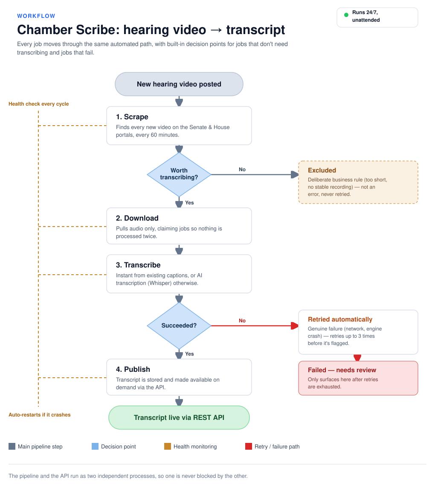

# Chamber Scribe

Scrapes Michigan legislative hearing videos (Senate + House), downloads their audio/captions, transcribes them, and serves the transcripts over a REST API.



## About me

Hi there, I'm Isabel, most call me Izzy, welcome to my README! As you go through the code, you'll see that I have a strong background in software development and a passion for creating efficient and scalable systems. I enjoy tackling complex problems and finding elegant solutions that make a real impact.
Please don't hesitate to ask any question, excited to chat!

- Email: [isabellopez0919@gmail.com](mailto:isabellopez0919@gmail.com)
- GitHub: [https://github.com/ilopez19](https://github.com/ilopez19)
- LinkedIn: [https://www.linkedin.com/in/isabellopez19](https://www.linkedin.com/in/isabellopez19/)

## How it works

1. **Scraper** (`services/scraper/`) polls the Senate API and House HTML pages every `SCRAPE_INTERVAL_SECONDS` (default 3600s) and queues every video it finds into MongoDB — nothing gets filtered out here.
2. **Downloader** (`services/downloader/`) picks up queued jobs every 30s and pulls audio only (never the full video) into `storage/audio/` — VTT captions straight from CloudFront for captioned videos, FFmpeg extraction for everything else.
3. **Transcriber** (`services/transcriber/`) picks up downloaded jobs every 30s. `should_transcribe()` is the one place that decides if a job is actually worth processing (e.g no content to translate) — everything else gets transcribed: instantly if a VTT exists, otherwise via Whisper. The MP3 is deleted afterward either way. Each attempt is logged as its own task document (`GET /tasks`) — so a retry or a VTT-failure-then-Whisper-fallback shows up as a separate row tied to the same job, instead of overwriting one record.
4. **Two ways a job can stop without a transcript**: `failed` means a genuine error (network failure, engine crash, missing file) — it's retried up to `JOB_MAX_RETRIES` times (default 3), then left failed and automatically re-queued from scratch next time the scraper rediscovers the video. `excluded` means a deliberate business-rule decision (too short, a live-channel entry with no stable recording) — not an error, not retried, and not re-queued on rediscovery, since the reason won't change. `failed` is the one worth checking; `excluded` is expected. `GET /jobs?status=failed` and `GET /jobs?status=excluded` list each — the `error` field on every returned job holds the specific reason.
5. **REST API** (`api/`) exposes jobs, transcripts, and per-attempt task logs over HTTP. `GET /health` reports on the pipeline process too, not just the API — each pipeline loop writes a heartbeat to Mongo every cycle, and `/health` reads those, since the API and the pipeline are separate processes that never talk directly. Returns HTTP 503 (not just a JSON field) if any loop's heartbeat has gone stale, so container/orchestrator healthchecks actually catch it.
6. **The pipeline runs under a restart-with-backoff wrapper** (`main.py`'s `run_forever()`) — if something gets past the individual loops' own error handling and crashes the whole process, it restarts automatically instead of staying down.

## Setup

**Requires:** Python 3.12 exactly (not 3.11 or 3.13 — the install scripts check for this specifically), [FFmpeg](https://ffmpeg.org/), and MongoDB.

**Windows:**

```
.\windows\install.ps1
```

This installs Python dependencies into a venv, and FFmpeg + MongoDB via `winget` if you don't already have them; if Python itself isn't found, it asks before installing it too (never installs anything without asking first). At the end it offers to start the pipeline + API for you right there. Safe to re-run. To do it by hand instead:

```
py -3.12 -m venv venv
venv\Scripts\activate
pip install -r requirements.txt
pip install torch --index-url https://download.pytorch.org/whl/cu130
winget install -e --id Gyan.FFmpeg
winget install -e --id MongoDB.Server
copy .env.example .env
```

Plain `pip install torch` gives you a CPU-only build, so Whisper will still work but run slower. If you have an NVIDIA GPU, use the `--index-url` above instead to get a CUDA build so Whisper actually uses the GPU. The `cu130` in that URL is the CUDA version PyTorch was built against, and it changes over time — get the current one from [pytorch.org](https://pytorch.org/get-started/locally/) rather than trusting this README to stay up to date.

**macOS/Linux:**

```
./macos-linux/install.sh
```

Same as Windows, just via Homebrew — if it's not executable yet, run `chmod +x macos-linux/*.sh` once or use `bash macos-linux/install.sh`. By hand instead of the script:

```
python3.12 -m venv venv
source venv/bin/activate
pip install -r requirements.txt
pip install torch
brew install ffmpeg
brew tap mongodb/brew && brew install mongodb-community
brew services start mongodb-community
cp .env.example .env
```

*Note: on M-series Macs, plain `pip install torch` already includes GPU (MPS) support — no separate index URL needed like on Windows.*

| Variable | Description |
|---|---|
| `MONGO_URI` | MongoDB connection string |
| `MONGO_DB_NAME` | Database name |
| `SCRAPE_INTERVAL_SECONDS` | How often the scraper polls the portals (seconds) |
| `JOB_MAX_RETRIES` | Optional, default 3. Retries before giving up on a job / re-queue threshold |
| `HF_HUB_DISABLE_SYMLINKS_WARNING` | Suppresses a HuggingFace warning on Windows (used by faster-whisper) |

Once the pipeline + API are running (see "Running" below), check everything's connected: `curl http://localhost:8000/health` — `"status": "ok"` means the API and Mongo are both reachable and every pipeline loop has heartbeated recently.

To test setup from scratch, `.\windows\uninstall.ps1` (Windows) or `./macos-linux/uninstall.sh` (macOS/Linux) removes the venv and uninstalls FFmpeg/MongoDB (asks for confirmation first).

## Running

Two separate processes — start both:

**Windows:**

```
.\windows\run.bat
venv\Scripts\uvicorn api.main:app --reload
```

**macOS/Linux:**

```
./macos-linux/run.sh
venv/bin/uvicorn api.main:app --reload
```

Each pair is the pipeline (scraper + downloader + transcriber loops) and the REST API.

### Stopping / restarting

`run.bat`/`run.sh` and `uvicorn` (from "Running" above) run in the foreground of whatever terminal started them — closing that terminal or hitting Ctrl+C stops them. For running both in the background instead, with a way to stop/restart them from elsewhere:

**Windows:**

```
.\windows\start.ps1
.\windows\stop.ps1
.\windows\restart.ps1
```

**macOS/Linux:**

```
./macos-linux/start.sh
./macos-linux/stop.sh
./macos-linux/restart.sh
```

`start` runs the pipeline + API in the background and logs to `logs/`; `stop` stops whatever `start` started; `restart` is `stop` then `start`. Both write PIDs to `.run/` so `stop`/`restart` know what to stop later. Either is a hard stop (not a graceful shutdown signal), so anything mid-download or mid-transcription gets killed rather than finishing first. That's expected — `claim_jobs()`'s re-claim logic picks those jobs back up automatically next time the pipeline starts, instead of leaving them stuck.

## Where things live

```
main.py                    Entry point — starts the scraper/downloader/transcriber loops under a restart-with-backoff wrapper

windows/                   Windows setup/lifecycle scripts (PowerShell + .bat)
  install.ps1                One-time setup: Python deps, FFmpeg, MongoDB
  uninstall.ps1               Reverses install.ps1 — removes venv, uninstalls FFmpeg/MongoDB
  run.bat                     Activates the venv and runs main.py (foreground)
  start.ps1                   Starts pipeline + API in the background, PIDs tracked in .run/
  stop.ps1                    Stops whatever start.ps1 started
  restart.ps1                 stop.ps1 then start.ps1

macos-linux/               macOS/Linux setup/lifecycle scripts (bash) — same jobs as windows/, one per file
  install.sh
  uninstall.sh
  run.sh
  start.sh
  stop.sh
  restart.sh

pytest.ini                 Test config
requirements-dev.txt       Adds pytest on top of requirements.txt

api/                       REST API (FastAPI)
  main.py                    App setup — run with uvicorn, not directly
  routes/                    One file per resource: jobs.py, transcripts.py, tasks.py, health.py

services/                  The three pipeline stages, one folder each
  scraper/
    scraper.py                Orchestrator — runs every detector, queues results into MongoDB
    portal_registry.py        Per-portal settings (expected video count, required fields, retries)
    detectors/                One file per portal: senate_portal.py, house_portal.py
    filter_utils.py, http_utils.py, metadata_utils.py    Shared helpers used by detectors
  downloader/
    downloader.py              Orchestrator — works through queued jobs
    rules.py                   Decides *how* to download a job (which strategy, what filename)
    strategies/                One file per download method: hls.py, http_audio.py, vtt.py
  transcriber/
    transcriber.py             Orchestrator — has should_transcribe() and the retry loop
    engines/                   whisper.py and vtt_engine.py — the two ways to get text from audio

shared/                    Code every stage depends on
  config.py                  Loads .env, defines JOB_MAX_RETRIES
  logging_config.py           Central logging setup — get_logger(__name__)
  db/database.py              MongoDB connection, claim_jobs() (atomic job claiming), heartbeat()
  db/models/                  One file per collection: job.py, transcript.py, task.py

tests/                     pytest suite — see "Notes for contributors" below

storage/                   Downloaded audio/captions (gitignored, created at runtime)

logs/                      Output from start.ps1/start.sh's background mode only (gitignored, auto-created).
                           run.bat/run.sh print straight to your terminal instead, so this stays empty then.
.run/                      PID files start.ps1/start.sh use to track/stop the background process (gitignored).
```

**Rule of thumb:** each pipeline stage only imports from its own folder or `shared/` — never from another stage's folder. If you're adding a new portal, only `scraper/` changes; a new download method, only `downloader/`; and so on.

## Notes for contributors

- Tests: `pip install -r requirements-dev.txt` then `python -m pytest`. Covers the business-logic-heavy pieces — `should_transcribe()`, VTT parsing, `DownloadRules.build_plan()` (including the live-channel exclusion), portal validation, dedup, and `claim_jobs()`'s concurrency guarantee (via an in-memory fake collection, so it runs without a real MongoDB instance). `tests/conftest.py` stubs `torch`/`faster_whisper` so the suite doesn't need a multi-GB ML install or a GPU just to test pure functions.
- There's no separate CLI for maintenance/debugging — the API is read-only by design (see `api/main.py`), so inspecting jobs/transcripts/tasks goes through the endpoints above. Anything the API doesn't expose (resetting a job, clearing a collection) means connecting directly, e.g. `mongosh $MONGO_URI`.
